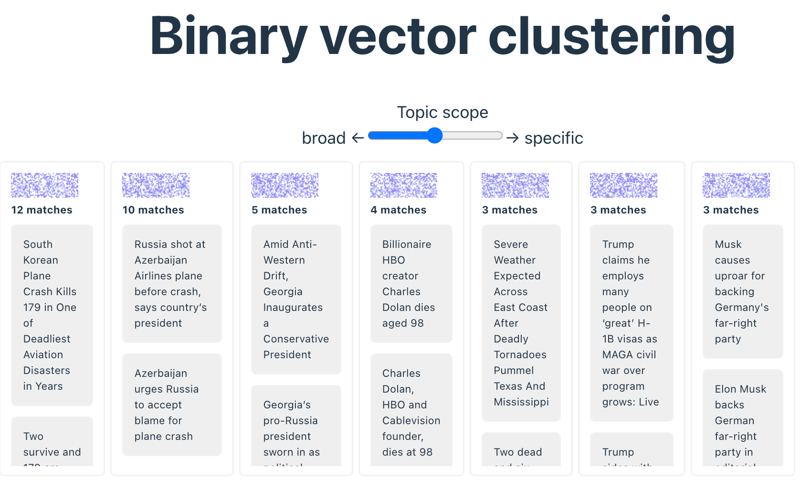

# QRy-codes-vue-helloworld Demo application

This demo application shows how the [@andorsearch/qry-codes-vue](https://github.com/markharwood/qry-codes-vue) components can be used
to cluster data.
In this demo, news data can be clustered by similarity.

Learn more about binary vectors in the client:
* See [QRy codes](https://qry.codes/)</a> for a searcher's guide.
* See  [this video](https://www.youtube.com/watch?v=sJU_8mtzH7Y) for a developer's guide

